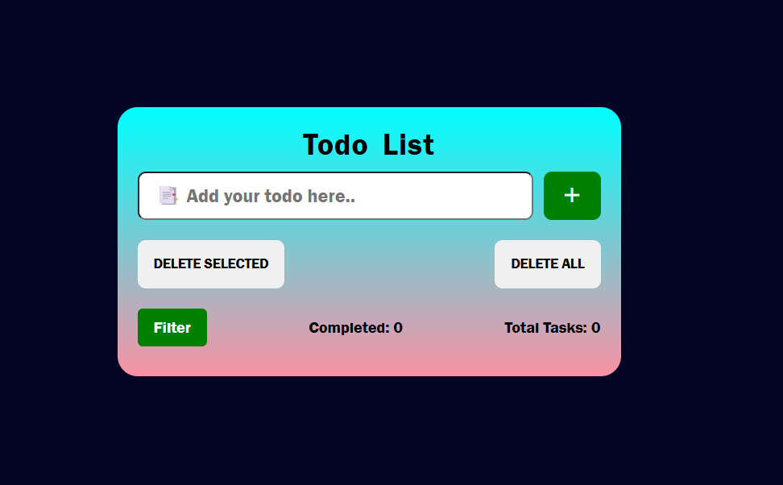
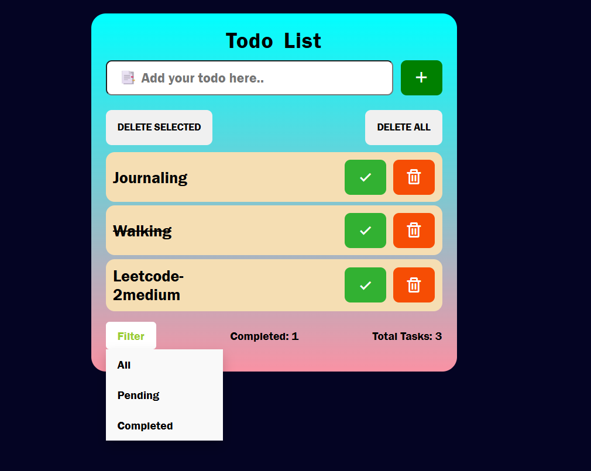

# TO-DO-LIST
A simple and interactive TO-DO LIST application built with vanilla JavaScript, HTML, and CSS to help you manage daily tasks efficiently.

## Live Demo
[View on GitHub Pages](https://virendrapratapsinghyadav.github.io/TO-DO-LIST/)

## Features
- Add Tasks: Enter a new task and add it to your list.
- Mark Tasks as Complete: Toggle tasks between completed and not completed.
- Delete Individual Tasks: Remove specific tasks from the list.
- Delete All Tasks: Clear the entire task list with a single click.
- Delete Completed Tasks: Remove only the tasks marked as completed
- Task Counters: Displays total tasks and completed tasks count dynamically.
- Keyboard Support: Add tasks by pressing the Enter key.

---

## Screenshots

## Installation & Usage
1.Clone the repository: git clone https://github.com/virendrapratapsinghyadav/TO-DO-LIST.git   
2.Open index.html in any modern browser.   
3.Start adding, completing, deleting, and filtering tasks.

## Technologies Used
- HTML5
- CSS3
- JavaScript (ES6+)
- 
## License
This project is licensed under the [MIT License](https://opensource.org/licenses/MIT).
 
